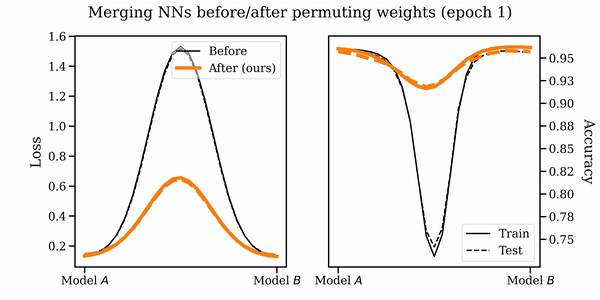

# Git Re-Basin: Merging Models modulo Permutation Symmetries

Code for the paper [Git Re-Basin: Merging Models modulo Permutation Symmetries](https://arxiv.org/abs/2209.04836).

Abstract:

> The success of deep learning is thanks to our ability to solve certain massive non-convex optimization problems with relative ease. Despite non-convex optimization being NP-hard, simple algorithms -- often variants of stochastic gradient descent -- exhibit surprising effectiveness in fitting large neural networks in practice. We argue that neural network loss landscapes contain (nearly) a single basin, after accounting for all possible permutation symmetries of hidden units. We introduce three algorithms to permute the units of one model to bring them into alignment with units of a reference model. This transformation produces a functionally equivalent set of weights that lie in an approximately convex basin near the reference model. Experimentally, we demonstrate the single basin phenomenon across a variety of model architectures and datasets, including the first (to our knowledge) demonstration of zero-barrier linear mode connectivity between independently trained ResNet models on CIFAR-10 and CIFAR-100. Additionally, we identify intriguing phenomena relating model width and training time to mode connectivity across a variety of models and datasets. Finally, we discuss shortcomings of a single basin theory, including a counterexample to the linear mode connectivity hypothesis.
